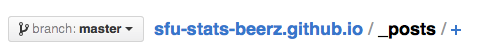
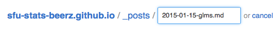
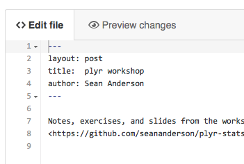
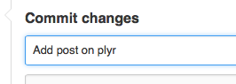
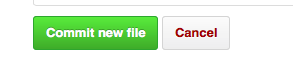
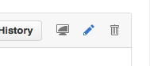
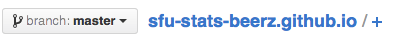

This repository holds archived mailing list material from the stats beerz mailing list.

See <https://sfu-stats-beerz.github.io> for the rendered webpage.

The website is created by the files in this repository on GitHub. If you know your way around Git and GitHub then you know what to do. If not, don't worry, I've created a quick illustrated guide for you below. You don't need to know anything about Git at all!

### To add a new post

Ask to be added to the `sfu-stats-beerz` group on GitHub.

Go into the `_posts` folder and click the `+`.



Make a new file that is named based on the date and up to a few words. E.g. `2014-01-28-dplyr`. The format of the date is important. That's what the post date gets created from.



Paste the text of an email or whatever you want to post into the document.

Add a header at the top that follows this format:

```
---
title:  A title for the post
author: Author Name
---
```



Write a commit message at the bottom. E.g. `Add a new post on ...`



Click the green `Commit new file` button. You're done!



Note that the post should be written in Markdown format. This is pretty basic and for the most part there's no need to edit an email you're posting at all. There are many helpful guides on the Internet about Markdown, e.g. <http://rmarkdown.rstudio.com/authoring_basics.html>.

In particular, note that for URLs to be clickable you need to wrap them in `< >` tags. E.g. `<http://website.com>`.

### To edit an old post

Find the post in the `_posts` folder, click on it, and click on the `Edit` button near the top right. Edit away, write a commit message, and commit your change. The site will re-generate on its own.



### To edit or add a new static (non-blog post) page

To add or edit a new static page (e.g. the About page, or maybe you want to add a link page), add or edit a Markdown (`.md`) file in the root folder. For example, take a look at the file `about.md` (click the `Raw` button when you're looking at that file to see the format). Again, either click on the file and then click `Edit` or click the `+` button to the right of `sfu-stats-beerz.github.io/`.


